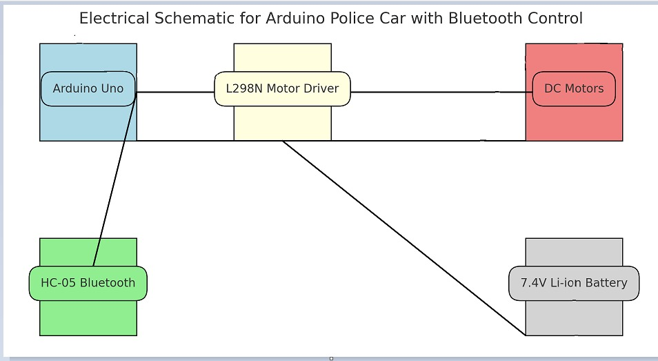

# Bluetooth police car

## Description

I want to make a police car that I can control from my phone. The car will be a 4-wheeler, it will have headlights and police lights (represented by different colored LEDs), a buzzer for the police sound. The car will be able to move using the phone, from where we can also choose the "mission" mode in which the police lights turn on, as well as the buzzer.

## Hardware Design
# Block Diagram

# Materials
* Motor Driver L298
* BlueTooth Modulator HC-05
* Arduino Uno
* Breadboard
* Leds
* Buzzer
* Arduino car kit (wheels, chassis, nuts etc)
* Li-ion Battery Case

## Software Design

## Results and Obstacles

## Conclusions

## Source Code and Resources    

